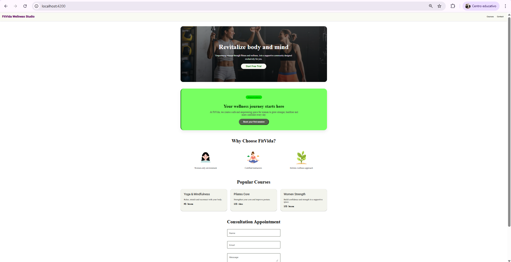

# FitVida Wellness Studio - Proyecto Angular Material

Este es el proyecto de la Unidad 4 para el módulo **DAW M09**. Se ha desarrollado una landing page para un estudio de bienestar utilizando Angular y Angular Material.

---

## Información del Alumno

* **Nombre Completo:** Anqi
* **Módulo:** DAW M09
* **Unidad:** 4 — Angular & Material
* **Fecha:** Marzo 2026

---

## Instrucciones de Ejecución

1. Instalar dependencias:

```bash
npm install
```

2. Ejecutar el proyecto:

```bash
ng serve
```

3. Abrir en el navegador:
   http://localhost:4200

---

## Theming

El proyecto utiliza un tema personalizado con Angular Material:

* **Primary:** Verde (#2E7D32) → mat.$green-palette
* **Secondary:** Naranja (#FF8F00) → mat.$orange-palette
* **Tipo:** Light Theme

Se utiliza `mat.define-theme()` y `mat.get-theme-color()` para aplicar los colores en todos los componentes.

---

## Componente personalizado

Se ha creado un componente llamado **hero-card** que:

* Usa un `@mixin` en SCSS
* Aplica colores del tema con `mat.get-theme-color()`
* Está incluido en `styles.scss`

---

## Captura del proyecto



---

## Requisitos cumplidos

* Angular Material instalado
* Tema personalizado (verde + naranja)
* Navbar, Hero, Cards, Formulario y Footer
* Componente personalizado con theming
* Proyecto funciona con `ng serve`
